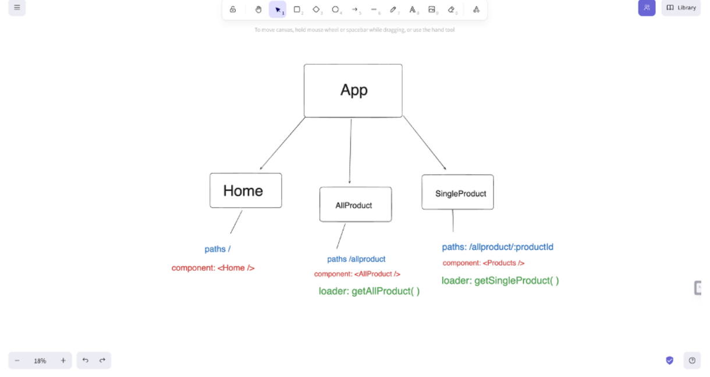
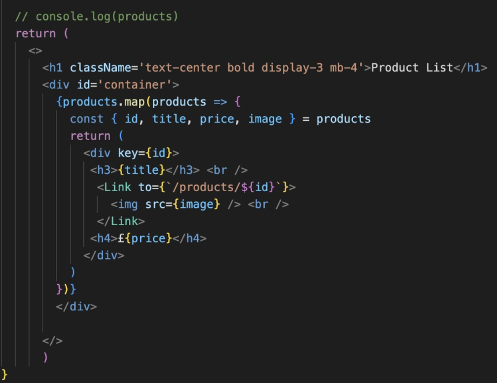
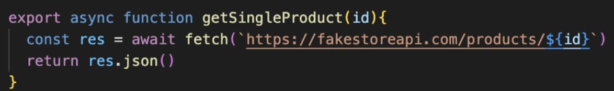
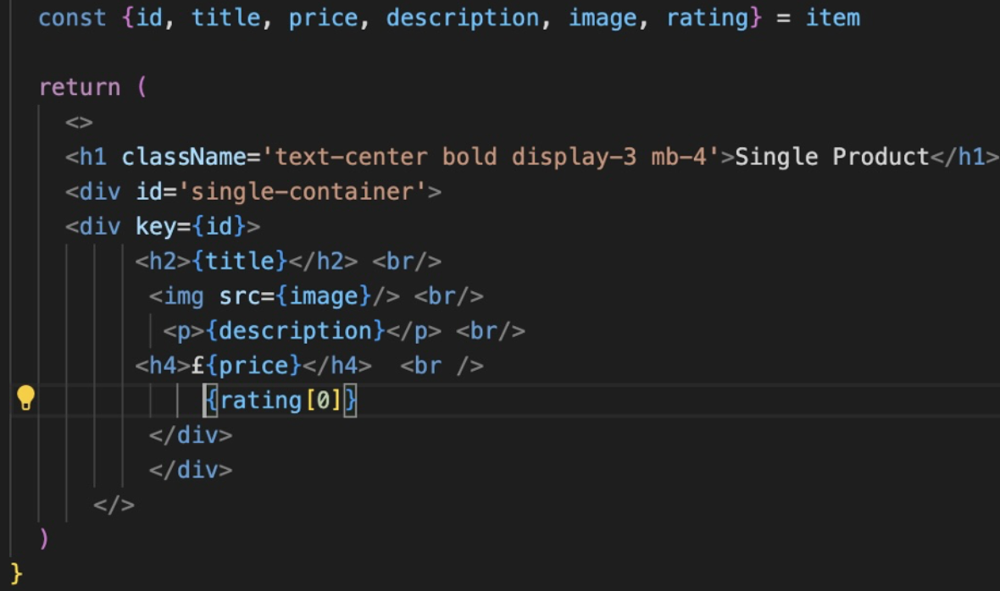

# Project-2
# E-commerce website

An e-commerce page functions as a digital marketplace where businesses display their products and product descriptions. Users can explore diverse offerings, access detailed product information, and engage in a user-friendly browsing experience. The page typically employs visual layouts and intuitive navigation to enhance the overall shopping experience for users.

## Deployment

[Visit the e-commerce site](https://e-commercehn.netlify.app/)

## Project Duration

We started working on this project from Wednesday 22nd November 2023 and finished the project Friday 24th November 2023. I worked with Nasiim Nuur. I had a great time working with him. We did have a late start unfortunately but we got lots done during that time.

## Technologies Used

The technologies we used are frontend React, React-bootstrap and JavaScript.

## Brief

Our goal was to create an application that utilizes APIs for displaying data on our webpage, which included:

- Consuming a public API
- Creating several components
- Implementing routing with React Router
- Designing wireframes
- Deploying the app online and hosting it on GitHub

## Planning

Our app's design process began with the creation of a wireframe, serving as a blueprint for our website's structure. This initial step focused on outlining the homepage, identifying navigational paths, and detailing the components necessary for a seamless user experience. For the product pages, we developed a comprehensive AllProduct section that showcases the entirety of our offerings. This section is designed to provide clients with essential information, including item prices and titles, accompanied by images to give a clear understanding of what is being purchased. For clients interested in a specific item, the SingleProduct page offers an in-depth look, featuring detailed descriptions to assist in their decision-making process. This methodical approach ensured our webpage was both organised and efficient, catering to our users' needs.

## Team management 

When Nasiim and I collaborated on this project, I took on the primary role of coding while we both engaged in navigating through the project's challenges together. Our approach to managing this pair project was deeply collaborative, involving continuous communication and shared decision-making. We divided tasks based on our strengths, with a focus on leveraging each other's skills to enhance the development process. I focused on planning and also I worked on 3 components that were homepage, AllProduct and navbar. Those are the 3 things I mainly focused on. This teamwork allowed us to tackle issues more effectively, brainstorm solutions, and ensure a smooth workflow from start to finish. Our partnership was instrumental in the project's progress, highlighting the importance of collaboration and mutual support in achieving our goals.

## Development Process

Day 1: Starting Off
We began our project by planning out where everything should go using Excalidraw. This helped us set up our files properly in a coding program called VS Code. To check our work, we used a tool called Insomnia to make sure our web pages could talk to our database and show the right information. We focused on making a 
homepage and a page that showed items that were already sold.

Day 2: Fixing and Decorating
Our main task was to make sure a page that shows a single item worked well. We ran into a small mistake where a link wasn’t working because we forgot an 's' at the end. While figuring this out, we also made the page look nice with some design work. After fixing the link, everything started working as we wanted, and our single item page was ready to go.

I created a React component that uses Bootstrap for styling a centered, bold title. Items are listed with details like titles and prices, using destructuring from an API and the product.map method for display. Links to product pages include images, and prices are shown with the currency symbol. The design aims to keep information clear but not overwhelming, with more details available on click. Finding a free, quality API was a challenge.

## Key Wins

This is the code I’m most proud of because this one was the most challenging part for me but also really proud of making work using my notes to navigate my way to successfully make everything I wanted to appear correctly. When it came to the Link path, I made spelling mistake making me really confused in why my code wasn’t functioning so I’ve asked my partner and my instructor for help and there realised there was missing ‘s’ in my product which is my link path which was something I really couldn’t see because I had really small-time frame to finish this project but most happy with this make my page have that appearance that things are working and the rest was simpler.

I created a React component that uses Bootstrap for styling a centered, bold title. Items are listed with details like titles and prices, using destructuring from an API and the product.map method for display. Links to product pages include images, and prices are shown with the currency symbol. The design aims to keep information clear but not overwhelming, with more details available on click. Finding a free, quality API was a challenge.

## Challenges

The most interesting problem I had to solve would be making my final page and to make sure it functions the right way this image above shows you how I use place id into parentheses and also make back ticks for the http API and to make sure I can target them by id making sure they have their own id’s own unique id really did enjoy solving these problems made things on my page work smoother and target everything I needed to target.
 
## Key Learnings

This project itself was a massive learning curve making me feel more confident playing around with APIs and also knowing how to destruct my codes because at the beginning of the week I was really finding trouble of understanding that but when I started this project I got actually do things on my own which made me have challenging moments, rewarding experiences but, at the end I’m happy that I created something like that is interactive and functioning honestly more to learn and I’m very excited to see what more we have coming up. Also working in a pair made way easier because you have an extra eye and also I work very well in a team. I like to break things down and make them in smaller pieces where we can hit each task in small chunks to eventually come out with a functioning site.

## Current Bugs

One issue we've encountered on our webpage involves the ratings, which, despite being coded correctly, unfortunately do not display as intended. The root cause of this anomaly remains unclear at this time. We are committed to resolving this and any other bugs, ensuring the webpage functions flawlessly. Below is an image illustrating the problem.

## Future Improvements

My future improvements would involve enhancing the styling of my site to ensure a more polished appearance. I also aim to thoroughly debug the site, ensuring there are no lingering issues. Improving my understanding of Bootstrap would facilitate smoother development. I intend to focus on importing and exporting consistently, as overlooking this step has caused confusion in the past. Additionally, I want to delve deeper into SCSS. I look forward to incorporating these improvements into my upcoming projects.

Thank you for exploring E-commerce website. Your feedback and suggestions for improvement are always welcome!
